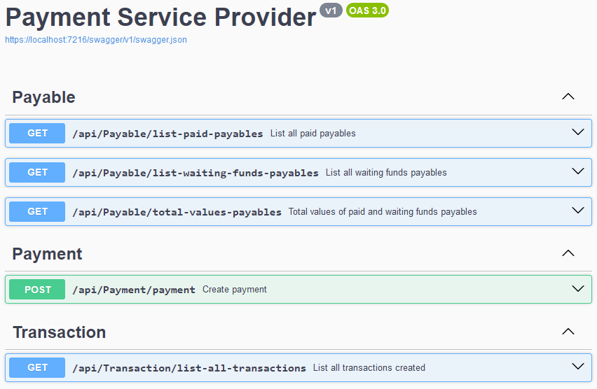

### Objetivos <h3>
Esse projeto tem o objetivo principal de servir como portfólio para demonstrar o uso da linguagem C# com framework ASP.NET Core, seus pacotes e ferramentas.

Também tem o intuito de estudo, desenvolvimento profissional e registro de minha envolução utilizando essas tecnologias. 

### Descrição do projeto <h3>
É um desafio back-end da Pagar.me, versão super simplificada de um serviço de pagamento (Payment Service Provider), originalmente proposto para ser desenvolvido em Node.js. A descrição na íntegra pode ser encontrada <a href="https://github.com/pagarme/vagas/blob/master/desafios/software-engineer-backend/README.md">aqui</a>.
 
* Endpoint payment -> O serviço processa transações recebendo as seguintes informações: Valor da trasação, descrição, método pagamento, número do cartão, nome do portador do cartão, data de validade do cartão e código verificador do cartão (CVV);
* Endpoint list-all-transactions -> Lista todas os/as pagamentos/transações criadas;
* Endpoint list-paid-payables -> Lista todos os recebíveis que tiveram o método de pagamento como cartão de débito;
* Endpoint list-waiting-funds-payables -> Lista todos os recebíveis que tiveram o método de pagamento como cartão de crédito;
* Endpoint total-values-payables -> Valores totais recebidos no débito e crédito.
### Tecnologias utilizadas <h3>
* C# para desenvolvimento do back-end;
* ASP.NET Core como framework;
* Entity Framework para persistência de dados;
* SQL Server como banco de dados relacional;
* Swagger para documentação dos endpoints da API;
* AutoMapper para transformar os retornos em DTOs;
* Moq, xUnit e FluentAssertions para testes.
### Ferramentas para desenvolvimento e testes <h3>
* Microsoft Visual Studio 2022 Community;
* SQL Server ObjectExplorer como gerenciador de bando de dados;
* Postman e Swagger para testes manuais;
* xUnit para testes automatizados.
### Como executar o projeto no Visual Studio 2022 <h3>
* Baixar o projeto no seu computador;
* Executar o comando "Update-Database CreateTable" no Package Manager Console do Visual Studio para criar as tabelas;
* Executar o projeto. 

Via Swagger os endpoints estão disponíveis no endereço https://localhost:7216/swagger/index.html.  
Com Postman na URL https://localhost:7216/. 

Os endpoints com verbo GET não possuem corpo e são os seguintes:  
<b>/api/Payable/list-paid-payables</b>  
<b>/api/Payable/list-waiting-funds-payables</b>  
<b>/api/Payable/total-values-payables</b>  
<b>/api/Transaction/list-all-transactions</b> 

O único endpoint com verbo POST é o <b>/api/Payment/payment</b> e recebe parâmetros no seguinte esquema:  
{
  "value": 200.50,
  "description": "Compra crédito loja Maria Jaona",
  "paymentMethod": 1,
  "cardNumbers": "954012640209671",
  "cardName": "ISABELLA FARIAS",
  "cardExpirationDate": "2027-11-01",
  "cardCvv": "0060"
}

<h1 align="center">
  
</h1>
